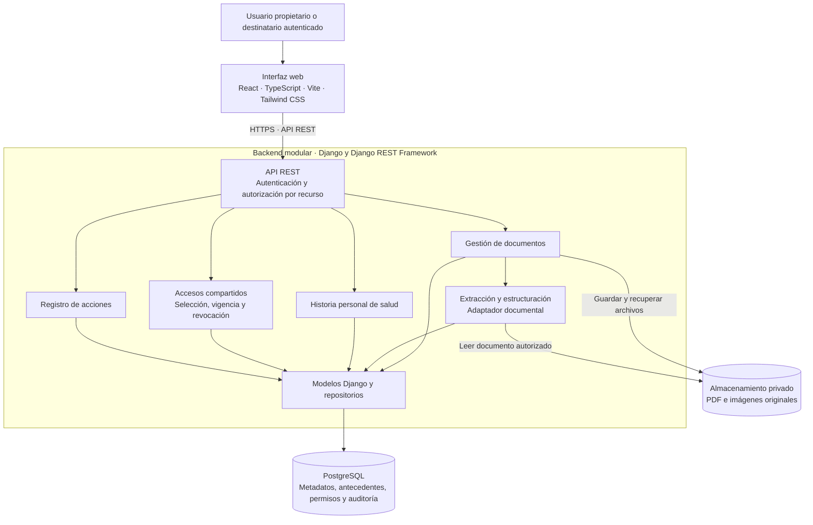

# Arquitectura inicial de MEDLINK

Propuesta de diseño para la presentación de avance de fase 2. Describe cómo se conectarán los componentes de MEDLINK para cargar documentos médicos, estructurar información, consultar una historia personal de salud y compartir documentos seleccionados. No representa una implementación ya terminada.

La base es la guía de definición del proyecto, apartados 4 a 7, y los mockups guardados en esta carpeta. El stack React, TypeScript, Vite, Tailwind CSS, Python, Django, Django REST Framework y PostgreSQL proviene del plan de trabajo. Las decisiones adicionales se identifican como propuestas para validar con el equipo.

## Diagrama de componentes

El diagrama muestra responsabilidades y dependencias, no servidores separados. El backend se propone como un monolito modular: una aplicación Django con módulos internos. Permite desarrollar e integrar el MVP sin administrar microservicios.

## Responsabilidades

| Componente | Responsabilidad |
|---|---|
| Frontend | Inicio de sesión, panel personal, carga, revisión de datos extraídos, historial y gestión de accesos compartidos. |
| API | Validar solicitudes, identificar al usuario y comprobar los permisos antes de consultar o modificar recursos. |
| Documentos | Validar archivos, guardar el original de forma privada y registrar sus metadatos y propietario. |
| Procesamiento | Extraer texto y campos de los tipos de documento incluidos en el MVP; registrar resultado, versión y errores del intento. |
| Historial | Presentar antecedentes confirmados en orden cronológico, con acceso a su documento de origen. |
| Compartir | Autorizar lectura de documentos seleccionados a un destinatario, durante un período definido. |
| Auditoría | Registrar acciones relevantes sin copiar contenido médico a los logs. |
| PostgreSQL | Mantener relaciones, metadatos, información estructurada y permisos. |
| Almacenamiento privado | Conservar el contenido binario fuera de rutas públicas. En desarrollo puede ser una carpeta privada. |

## Flujo principal

1. El propietario inicia sesión y selecciona un documento.
2. La API valida el tamaño, el tipo real del archivo y la identidad del propietario.
3. El backend guarda el original con una clave interna y registra sus metadatos.
4. El módulo de procesamiento crea un intento de extracción y obtiene información estructurada.
5. Los antecedentes obtenidos quedan pendientes de revisión. El usuario confirma o corrige la información antes de incorporarla al historial visible.
6. El historial permite consultar el antecedente y volver al documento original.
7. El propietario selecciona documentos y un destinatario para crear un acceso de solo lectura con vencimiento.
8. Cada consulta del destinatario vuelve a comprobar identidad, selección de documentos, vigencia y revocación.

Si la extracción falla, se conserva el original y se informa el error. La falla no debe presentarse como procesamiento exitoso ni generar información clínica confirmada.

## Autenticación y control de acceso propuestos

- Usar el sistema de usuarios de Django y autenticación mediante sesiones. Publicar frontend y API bajo el mismo origen en el entorno de demostración para simplificar la integración.
- En producción, usar HTTPS, cookie de sesión `HttpOnly` y `Secure`, una política `SameSite` adecuada y protección CSRF en operaciones que modifican datos.
- El propietario puede gestionar sus documentos y antecedentes. Otro usuario accede únicamente mediante un permiso compartido válido.
- El destinatario debe tener cuenta e iniciar sesión. Seleccionar un correo en la interfaz no basta para autorizar acceso.
- El permiso compartido es de solo lectura. No permite modificar antecedentes ni crear nuevos accesos.
- Los archivos se entregan mediante endpoints protegidos. Conocer una clave de almacenamiento o un identificador no concede acceso.

Estas son decisiones de diseño propuestas. Su implementación y eficacia deberán demostrarse con pruebas posteriores.

## Procesamiento documental propuesto

Definir primero un conjunto pequeño de documentos de prueba y sus campos esperados. El adaptador de extracción permite elegir después una herramienta para PDF con texto y una herramienta OCR para imágenes o documentos escaneados, sin acoplar todo el sistema a un proveedor.

Para una primera versión se propone procesamiento dentro del backend, con límites de tiempo y tamaño y estados de éxito o error explícitos. Antes de adoptar ese modo, se debe medir su duración con los documentos de prueba. Si excede el tiempo aceptable de una solicitud, se incorporará una cola y un trabajador en segundo plano; esa ampliación no se considera implementada ni seleccionada en esta arquitectura inicial.

No se ha definido proveedor de IA, motor OCR ni una precisión de extracción. El resultado requiere revisión del usuario y no se interpreta como diagnóstico médico.

## Contrato inicial de API propuesto

| Operación | Endpoint orientativo | Permiso |
|---|---|---|
| Iniciar y cerrar sesión | `POST /api/auth/login/`, `POST /api/auth/logout/` | Según sesión y protección CSRF. |
| Listar y cargar documentos | `GET /api/documents/`, `POST /api/documents/` | Propietario. |
| Consultar y descargar un documento | `GET /api/documents/{id}/`, `GET /api/documents/{id}/file/` | Propietario o destinatario con permiso válido. |
| Solicitar procesamiento | `POST /api/documents/{id}/extractions/` | Propietario. |
| Consultar antecedentes | `GET /api/health-events/` | Propietario; para destinatarios, solo antecedentes confirmados de documentos autorizados. |
| Revisar un antecedente | `PATCH /api/health-events/{id}/` | Propietario. |
| Crear un acceso compartido | `POST /api/shares/` | Propietario de todos los documentos seleccionados. |
| Revocar un acceso | `POST /api/shares/{id}/revoke/` | Propietario del acceso. |

Los endpoints son una propuesta de contrato, no rutas existentes. Todas las consultas y operaciones por identificador deben aplicar autorización por recurso.

## Alcance inicial y decisiones pendientes

| Tema | Propuesta inicial | Validación pendiente |
|---|---|---|
| Titular de la información | Cada cuenta administra su propia historia de salud. | Confirmar que familiares y dependientes quedan fuera del MVP. |
| Compartir | Destinatario con cuenta, documentos seleccionados, vencimiento y revocación. | Confirmar si se requiere otro mecanismo de invitación. |
| Formatos y tamaño | PDF, JPG y PNG, hasta 10 MB, según el mockup. | Confirmar requerimiento y validación del contenido real. |
| Extracción | Un conjunto acotado de documentos, con revisión humana. | Seleccionar tipos, campos, herramienta y medir duración. |
| Despliegue | Frontend y API bajo el mismo origen, PostgreSQL y archivos privados. | Elegir alojamiento, copias de respaldo y gestión de secretos. |
| Eliminación de datos | Diseñar la política antes de habilitar borrado. | Definir qué ocurre con archivos, antecedentes, accesos y auditoría. |

El modelo de datos asociado está en [Modelo inicial de datos](../MODELO_DATOS/Modelo_datos_inicial_MEDLINK.md).
