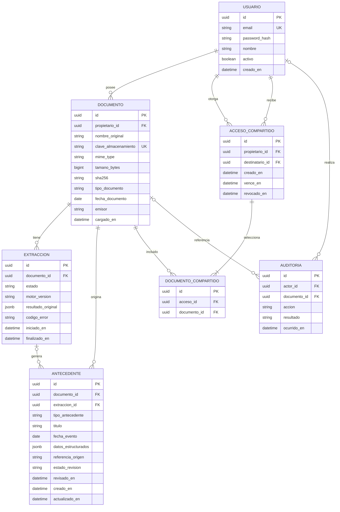

# Modelo inicial de datos de MEDLINK

Propuesta de modelo lógico para fase 2, alineada con la arquitectura inicial. Permite relacionar usuarios, documentos médicos, extracción de información, antecedentes de salud y accesos compartidos. No implica que las tablas o migraciones ya existan.

Se propone PostgreSQL y modelos Django. Los identificadores se representan como UUID, las fechas con hora se almacenan con zona horaria y las claves foráneas mantienen la trazabilidad. La configuración exacta se resolverá al implementar las migraciones.

## Supuestos del MVP

- Una cuenta administra la información médica de su titular. No se incluyen historias de familiares ni dependientes en esta versión.
- Cada documento tiene un propietario. Un documento puede originar varios antecedentes y varios intentos de extracción.
- Un antecedente procede de un documento. Su relación con una extracción es opcional para permitir registrar información manualmente a partir del original.
- Los datos extraídos necesitan revisión antes de mostrarse como antecedentes confirmados.
- Se comparten documentos completos y sus antecedentes confirmados, no campos individuales de un mismo documento.
- El destinatario es otra cuenta autenticada. Los accesos compartidos tienen vencimiento y pueden revocarse.

Estos supuestos son decisiones propuestas para validar con el equipo y el docente.

## Diagrama entidad relación



`PK` indica clave primaria, `FK` clave foránea y `UK` valor único. La relación opcional de extracción permite antecedentes ingresados manualmente desde un documento. La auditoría admite acciones del sistema sin actor y acciones de sesión sin documento.

## Entidades y campos

### Usuario

Identidad de acceso. Una misma cuenta puede ser propietaria de documentos y destinataria de información compartida. No se necesita un rol global de médico para conceder lectura de un documento.

| Campo | Regla |
|---|---|
| `id` | UUID, clave primaria. |
| `email` | Obligatorio y único bajo una política coherente de normalización. |
| `password_hash` | Representación conceptual del campo de contraseña de Django; usar su mecanismo de hash, nunca texto plano. |
| `nombre` | Nombre visible del usuario. |
| `activo`, `creado_en` | Estado de la cuenta y fecha de creación. |

Se propone un modelo de usuario personalizado desde la primera migración para permitir correo como identidad de acceso y UUID como identificador.

### Documento

Metadatos del archivo original. Su propietario determina quién puede administrar los antecedentes derivados.

| Campo | Regla |
|---|---|
| `propietario_id` | Usuario propietario obligatorio. |
| `nombre_original` | Nombre de presentación; no utilizarlo como ruta del archivo. |
| `clave_almacenamiento` | Identificador interno único del archivo privado. |
| `mime_type`, `tamano_bytes` | Tipo validado y tamaño positivo dentro del límite permitido. |
| `sha256` | Huella para identificar posibles duplicados; no concede acceso ni requiere unicidad global. |
| `tipo_documento` | Catálogo inicial: examen, receta, informe u otro. |
| `fecha_documento`, `emisor` | Opcionales si no se conocen. |
| `cargado_en` | Fecha real de incorporación al sistema. |

La fecha de carga y la fecha del documento tienen significados distintos y deben conservarse separadas.

### Extracción

Un intento de procesar un documento. Conservar intentos separados permite diagnosticar fallas y distinguir reprocesamientos.

| Campo | Regla |
|---|---|
| `documento_id` | Documento procesado obligatorio. |
| `estado` | Pendiente, procesando, completada o fallida. |
| `motor_version` | Identificación de herramienta y versión utilizadas. |
| `resultado_original` | JSONB opcional, con resultado previo a correcciones. Mantenerlo como evidencia del intento. |
| `codigo_error` | Opcional; no incluir secretos ni contenido médico en el mensaje público. |
| `iniciado_en`, `finalizado_en` | Opcionales mientras el intento no comienza o no termina. El fin no puede preceder al inicio. |

El resultado original no se entrega al destinatario del acceso compartido. Se evita lanzar dos procesamientos simultáneos del mismo documento mediante una regla transaccional de aplicación.

### Antecedente

Entrada de la historia personal: por ejemplo, un examen, una prescripción o una consulta. Se conserva su fuente para permitir verificar la información.

| Campo | Regla |
|---|---|
| `documento_id` | Fuente obligatoria; determina el propietario sin duplicar `usuario_id`. |
| `extraccion_id` | Opcional. Si existe, debe corresponder al mismo documento. |
| `tipo_antecedente`, `titulo` | Tipo y descripción breve obligatorios. |
| `fecha_evento` | Opcional si se desconoce. No sustituirla automáticamente por la fecha de carga. |
| `datos_estructurados` | JSONB validado según el tipo de antecedente. |
| `referencia_origen` | Página, sección o referencia equivalente, cuando la extracción permita obtenerla. |
| `estado_revision` | Pendiente, confirmado o descartado. |
| `revisado_en` | Fecha de confirmación o descarte por el propietario. |
| `creado_en`, `actualizado_en` | Fechas de creación y última modificación. |

Ejemplo ficticio del contenido de `datos_estructurados` para un examen:

```json
{
  "tipo": "examen",
  "nombre": "Hemograma",
  "resultados": [
    {"parametro": "Hemoglobina", "valor": "13.5", "unidad": "g/dL"}
  ]
}
```

JSONB permite comenzar con pocos tipos de documentos sin crear numerosas tablas clínicas. Debe tener un esquema de validación por tipo; no es un contenedor libre de texto sin reglas. Si posteriormente se necesita consultar y comparar cada resultado de laboratorio de manera intensiva, se podrá normalizar esa parte en tablas específicas.

El historial cronológico usa `fecha_evento`. Los antecedentes sin fecha se muestran en una sección identificada como tal. Los borradores se muestran en revisión, separados del historial confirmado.

### Acceso compartido

Autorización del propietario para que un destinatario lea una selección de documentos.

| Campo | Regla |
|---|---|
| `propietario_id` | Usuario que concede el acceso. |
| `destinatario_id` | Usuario autenticado que lo recibe; distinto del propietario. |
| `creado_en`, `vence_en` | Inicio y vencimiento obligatorios; el vencimiento debe ser posterior a la creación. |
| `revocado_en` | Nulo mientras no se haya revocado. |

El permiso es siempre de solo lectura en el MVP. El estado vigente se calcula usando tiempo y revocación; no se guarda un booleano que pueda quedar desactualizado. La API autoriza únicamente si el destinatario coincide, el acceso no está revocado, no ha vencido y el documento forma parte de la selección.

### Documento compartido

Tabla intermedia que resuelve la relación muchos a muchos entre accesos y documentos.

| Campo | Regla |
|---|---|
| `acceso_id`, `documento_id` | Claves foráneas obligatorias. |
| Par `(acceso_id, documento_id)` | Único para impedir documentos duplicados en un mismo acceso. |

Todo documento seleccionado debe pertenecer al propietario del acceso. Un acceso se crea con al menos un documento, en una transacción. Estas reglas requieren validación de aplicación o una restricción adicional; las claves foráneas por sí solas no las garantizan.

### Auditoría

Registro de cargas, procesamiento, revisión, lectura, descarga, creación de accesos y revocación.

| Campo | Regla |
|---|---|
| `actor_id` | Opcional para acciones del sistema. |
| `documento_id` | Opcional para acciones no asociadas a un documento. |
| `accion`, `resultado` | Acción ejecutada y resultado permitido o denegado. |
| `ocurrido_en` | Fecha y hora de la acción. |

No almacenar contraseñas, tokens ni contenido clínico en este registro. Si se necesita historial detallado de cambios de campos médicos, debe diseñarse como una ampliación específica; esta tabla no equivale a un historial completo de versiones.

## Integridad e índices propuestos

| Regla | Lugar de aplicación |
|---|---|
| Email, clave de almacenamiento y selección de documento únicos. | Restricciones de PostgreSQL. |
| Tamaño positivo y vencimiento posterior a creación. | Restricciones `CHECK` y validación de API. |
| Catálogos de estados y tipos permitidos. | Validación de modelos/API y restricciones de base de datos. |
| Extracción y antecedente pertenecen al mismo documento. | Validación transaccional; valorar una restricción compuesta al implementar. |
| Documentos compartidos pertenecen al otorgante. | Validación transaccional antes de crear el acceso. |
| Un acceso contiene al menos un documento. | Creación transaccional y validación de aplicación. |
| Solo el propietario modifica un recurso; destinatario únicamente lee. | Autorización de API en cada operación. |
| Reprocesar no duplica antecedentes confirmados. | Política explícita: crear nuevos borradores y no reemplazar confirmados automáticamente. |

Índices iniciales sugeridos: documentos por `(propietario_id, cargado_en)`, antecedentes por `(documento_id, fecha_evento)`, extracciones por `(documento_id, iniciado_en)`, accesos por `(destinatario_id, vence_en)` y auditoría por `(documento_id, ocurrido_en)`. Las claves foráneas también deben contar con los índices necesarios según las migraciones generadas.

Antes de implementar eliminación, se debe definir la política de retención y el tratamiento de originales, antecedentes, extracciones y accesos. Hasta entonces, evitar borrados en cascada que destruyan trazabilidad sin una decisión explícita.

## Ejemplo del modelo

Una usuaria carga un hemograma. Se crea un documento y un intento de extracción. El resultado produce uno o varios antecedentes pendientes, que conservan el documento y la extracción de origen. Tras revisar, la usuaria confirma los datos. Luego crea un acceso para otra cuenta, selecciona el hemograma y define siete días de vigencia. La tabla intermedia identifica ese documento; los demás documentos de la usuaria siguen fuera del permiso. Revocar el acceso bloquea nuevas consultas autorizadas por ese permiso.

La arquitectura asociada está en [Arquitectura inicial](../ARQUITECTURA/Arquitectura_inicial_MEDLINK.md).
